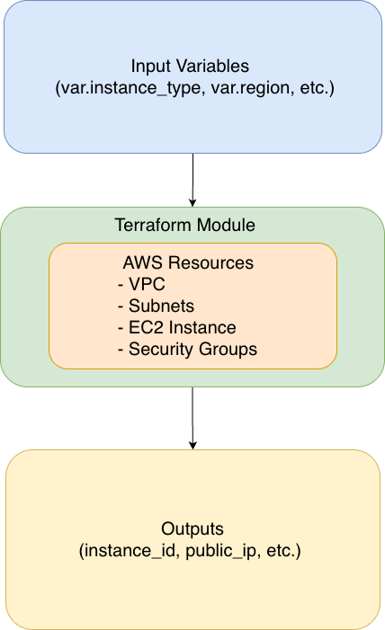

# AWS Terraform 模組化架構

這個專案使用模組化的方式組織 Terraform 代碼，建立完整的 VPC 網路架構，包含 Public 和 Private Subnet、NAT Gateway 以及 SSM Session Manager 支援。

## 架構圖



## 專案結構

```
.
├── main.tf                  # 主配置文件，調用各個模組
├── variables.tf             # 全局變數定義
├── outputs.tf               # 全局輸出定義
├── versions.tf              # Terraform 和 Provider 版本設定
├── terraform.tfvars         # 變數實際值（不要提交敏感資料）
├── terraform.tfvars.example # 變數範例檔
└── modules/                 # 模組目錄
    ├── vpc/                 # VPC 模組
    │   ├── main.tf
    │   ├── variables.tf
    │   └── outputs.tf
    ├── security-group/      # Security Group 模組
    │   ├── main.tf
    │   ├── variables.tf
    │   └── outputs.tf
    └── ec2/                 # EC2 模組
        ├── main.tf
        ├── variables.tf
        └── outputs.tf
```

## 架構說明

### 網路架構
```
VPC (10.0.0.0/18)
├── Public Subnet (10.0.0.0/20)
│   ├── Internet Gateway
│   ├── NAT Gateway
│   └── Public EC2 Instance
└── Private Subnet (10.0.16.0/20)
    ├── NAT Gateway (通過 Public Subnet)
    └── Private EC2 Instance
```

### VPC 模組 (`modules/vpc/`)
負責創建：
- VPC
- Internet Gateway
- **Public Subnet** (位於 availability zone a)
- **Private Subnet** (位於 availability zone c)
- **NAT Gateway** 和 **Elastic IP**
- Public 和 Private Route Tables
- Route Table Associations

**輸出：**
- `vpc_id` - VPC ID
- `public_subnet_id` - Public Subnet ID
- `private_subnet_id` - Private Subnet ID
- `internet_gateway_id` - Internet Gateway ID
- `nat_gateway_id` - NAT Gateway ID
- `nat_eip` - NAT Gateway Elastic IP

### Security Group 模組 (`modules/security-group/`)
負責創建：
- EC2 Security Group（包含 SSH、HTTP、HTTPS 規則）
- 允許所有出站流量（用於 SSM 和軟體更新）

**輸出：**
- `security_group_id` - Security Group ID

### EC2 模組 (`modules/ec2/`)
負責創建：
- EC2 Instance（使用最新的 Amazon Linux 2023 AMI）
- **IAM Role 和 Instance Profile**（支援 SSM Session Manager）
- 配置 Instance Metadata Service（IMDSv2 相容）
- 包含基本的 Apache httpd 設置

**輸出：**
- `instance_id` - EC2 Instance ID
- `public_ip` - EC2 Public IP
- `private_ip` - EC2 Private IP

## 功能特色

### 🔐 SSM Session Manager 支援
- 無需開放 SSH port 即可安全連接到 EC2 實例
- 所有實例都配置了必要的 IAM role 和權限
- 支援 Public 和 Private 實例

**連接方式：**
```bash
# 連接到 Public EC2
aws ssm start-session --target <public-instance-id>

# 連接到 Private EC2
aws ssm start-session --target <private-instance-id>
```

### 🌐 NAT Gateway
- Private Subnet 可以訪問外網（用於軟體更新、SSM 通信等）
- 使用 Elastic IP 確保固定的出站 IP

### 🔒 安全性
- Private EC2 不直接暴露在公網
- 使用 IMDSv2 相容模式確保 metadata 安全
- Security Group 限制入站流量
- 所有出站流量允許（用於正常的服務通信）

## 使用方式

### 1. 複製範例配置檔
```bash
cp terraform.tfvars.example terraform.tfvars
```

### 2. 編輯 terraform.tfvars
```hcl
project_name     = "your-project"
environment      = "dev"
aws_region       = "ap-northeast-1"
key_name         = "your-key-pair-name"
allowed_ssh_cidr = ["your-ip/32"]
instance_type    = "t3.micro"
```

### 3. 初始化 Terraform
```bash
terraform init
```

### 4. 查看執行計劃
```bash
terraform plan
```

### 5. 應用配置
```bash
terraform apply
```

### 6. 查看輸出
```bash
terraform output
```

### 7. 連接到實例

**使用 SSM Session Manager（推薦）：**
```bash
# 取得實例 ID
terraform output public_ec2_instance_id
terraform output private_ec2_instance_id

# 連接
aws ssm start-session --target <instance-id>
```

**使用 SSH（僅限 Public EC2）：**
```bash
# 從 terraform output 取得 SSH 命令
terraform output ssh_command

# 或手動連接
ssh -i ~/.ssh/your-key.pem ec2-user@<public-ip>
```

## 創建的資源清單

執行 `terraform apply` 後會創建：

- ✅ 1 個 VPC
- ✅ 1 個 Internet Gateway
- ✅ 1 個 NAT Gateway
- ✅ 1 個 Elastic IP
- ✅ 2 個 Subnets（Public 和 Private）
- ✅ 2 個 Route Tables
- ✅ 1 個 Security Group
- ✅ 2 個 EC2 Instances
- ✅ 2 組 IAM Roles、Policies 和 Instance Profiles（用於 SSM）

## 模組的優點

1. **可重複使用**：每個模組都可以在不同的專案中重複使用
2. **易於維護**：每個模組獨立管理，修改時不會影響其他部分
3. **清晰的架構**：將基礎設施按功能劃分，更容易理解
4. **團隊協作**：不同團隊成員可以同時維護不同的模組
5. **版本控制**：可以為每個模組單獨設定版本

## 成本考量

此架構會產生以下費用：
- **EC2 Instances**：依照實例類型計費（t3.micro 符合免費方案）
- **NAT Gateway**：約 $0.045/小時 + 數據傳輸費用
- **Elastic IP**：如果未使用會有小額費用
- **數據傳輸**：跨 AZ 和對外的數據傳輸

如果想降低成本：
- 可以移除 NAT Gateway（Private Subnet 將無法訪問外網）
- 使用 VPC Endpoints 替代 NAT Gateway（針對 AWS 服務）

## 清理資源

當不再需要這些資源時：
```bash
terraform destroy
```

**注意**：銷毀順序由 Terraform 自動處理，但確保：
- 所有依賴資源已正確定義
- NAT Gateway 和 Elastic IP 會被正確清理

## 故障排除

### SSM Session Manager 無法連接

1. **檢查實例是否在線**
   ```bash
   aws ssm describe-instance-information \
     --filters "Key=InstanceIds,Values=<instance-id>"
   ```

2. **驗證 IAM Role**
   ```bash
   aws ec2 describe-instances --instance-ids <instance-id> \
     --query 'Reservations[0].Instances[0].IamInstanceProfile'
   ```

3. **重啟 SSM Agent**（如果需要）
   - SSH 到實例
   - 執行：`sudo systemctl restart amazon-ssm-agent`

### Private EC2 無法訪問外網

1. 檢查 NAT Gateway 狀態
2. 驗證 Private Route Table 包含指向 NAT Gateway 的路由
3. 確認 Security Group 允許出站流量

## 注意事項

- ⚠️ 不要將 `terraform.tfvars` 提交到版本控制系統（已在 `.gitignore` 中）
- ⚠️ 確保 AWS 憑證已正確配置
- ⚠️ 記得修改 `allowed_ssh_cidr` 為您的實際 IP，提高安全性
- ⚠️ NAT Gateway 會產生費用，不使用時記得 `terraform destroy`
- ✅ 使用 SSM Session Manager 替代 SSH，更安全且不需要管理 SSH 密鑰
- ✅ 所有實例都已預裝 SSM Agent（Amazon Linux 2023）

## 參考資源

- [Terraform AWS Provider 文檔](https://registry.terraform.io/providers/hashicorp/aws/latest/docs)
- [AWS Systems Manager Session Manager](https://docs.aws.amazon.com/systems-manager/latest/userguide/session-manager.html)
- [AWS VPC 文檔](https://docs.aws.amazon.com/vpc/)
- [NAT Gateway 最佳實踐](https://docs.aws.amazon.com/vpc/latest/userguide/vpc-nat-gateway.html)
